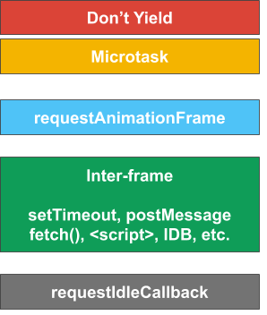
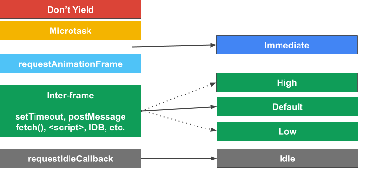

# Main Thread Scheduling: Prioritized postTask API

For an overview of the larger problem space, see [Main Thread Scheduling API](README.md).

## TL;DR

Userspace tasks often have varying degrees of importance (related to user
experience), but the Platform lacks a unified API to schedule prioritized work.


## The Problem

To keep apps responsive, developers can (and should) break up long tasks into
smaller chunks.  [Userspace schedulers](UserspaceSchedulers.md) often manage
these chunks of work (tasks)&mdash;prioritizing and executing work
asynchronously at an appropriate time relative to the current situation of the
user and browser.

These tasks&mdash;or groups of related tasks&mdash;usually have a priority
attached, i.e. not all work has the same importance. Work related to rendering
in-viewport content, for example, is more important than rendering content that
is just out of the viewport but might be seen soon. And that priority is
subject to change, e.g. in response to user input.

Userspace schedulers use priority to order execution of tasks they control, but
this has limited meaning since they do not control all tasks on the page. Apps
can consist of 1P, 1P library, 3P, and (one or more) framework script, all of
which competes for the main thread. At the same time, the browser has tasks to
run on the main thread, such as async work (e.g. `fetch()` and IDB tasks) and
garbage collection.

### Existing Priorities

The problem is that developers have little control over the priority that their
tasks run within the browser, as the Platform only exposes a few priorities,
either explicitly or implicitly through a disparate set of APIs. UAs have the
ability to prioritize tasks on a
*[per-task-source](https://html.spec.whatwg.org/multipage/webappapis.html#task-source)
basis*, but there is no way for developers to differentiate priority between
tasks of a given task source.

The current state of prioritization in the browser looks something like this:



The first two&mdash;*microtask* and *don't yield*&mdash;are generally
antithetical to scheduling and the goal of improving responsiveness. They are
implicit priorities that developers can and do use.

`requestAnimationFrame`, which was designed for animations, is used (abused) by
userspace code to gain higher priority, since rendering is often prioritized by
UAs. Scheduling work at this "priority" has the disadvantage of incurring extra
overhead caused by running the rendering lifecycle updates (they may early-out,
but this is still more heavy-weight than may be needed if not updating DOM).

rAF runs during the [update the
renderinging](https://html.spec.whatwg.org/multipage/webappapis.html#update-the-rendering)
step of the event loop processing model. It is up to the UA to determine whether
or not there is a rendering opportunity which will result in rAF to run.

Idle callbacks essentially run when there is no other work that can be done,
subject to rules about when an idle period can begin. This can be a good, albeit
complicated scheduling tool, but is not a sufficient expression of priority for
what app developers need.

Everything else, such as `setTimeout`, `postMessage` and `fetch` completions
run in between rendering opportunities (labeled as *inter-frame* here). The
browser has flexibility to prioritize between task sources, but not necessarily
visibility into task importance.

### Lack of a unified API

A sub-problem here is that there is no unified scheduling API. Instead,
developers have had to resort to various hacks, such as using [postMessage to get
around setTimeout(0)'s delay](https://dbaron.org/log/20100309-faster-timeouts),
or using rAF to gain higher priority.

This complicates code, is onerous for developers to learn and write, and can
have negative performance effects (e.g. gratuitous rendering lifecycle updates).

## Proposal

To address these problems, we propose adding a unified prioritized task
scheduling API, `postTask`, that allows developers to schedule work
with a set of standard priorities directly through a native scheduler.

### Priorities

At the core of this API is a set of priorities. We have selected an initial
minimal set of *semantically significant* priorities. Semantically meaningful
naming helps developers understand when it is appropriate to use a given
priority and enable easier coordination, and there is precedent in other
systems. Similar priorities (and a similarly small set) can be found in other
platforms like Apple's
[QoSClass](https://developer.apple.com/documentation/dispatch/dispatchqos/qosclass)
and Chromium's internal [browser task
queues](https://cs.chromium.org/chromium/src/content/browser/scheduler/browser_task_queues.h).

**Note**: The number of priorities can be extended if there are use cases not
covered by this minimal set of priorities. We also understand that apps may have
finer-grained app-specific priorities, and are considering additional APIs to
support these (see FAQ below).



1. **user-blocking**: User-blocking tasks are tasks that block a user from
   interacting with and using the app. This could be (chunked) work that is
   directly in response to user input, or updating in-viewport UI state.

2. **user-visible**: User-visible tasks are those that will be visible to the
   user, but not either not immediately or do not block the user from
   interacting with the page. These tasks represent either a different
   importance or timescale as user-blocking tasks.

   **Note**: this is the default `postTask` priority if a priority is not
   specified.


3. **background**: Background tasks are low priority tasks that are not
   time-sensitive and not visible to the user.

#### Scheduling between prioritized tasks and other task sources

The API does not specify how UAs should schedule between prioritized tasks
(`postTask` tasks) and other task sources. It likely makes sense to schedule
some task sources (e.g. timers) at a priority lower than user-blocking, but we
want to leave room for UAs to experiment with prioritization. These semantic
priorities can be used as further information to make scheduling decisions with
respect to choosing which task source to select a task from.

We may find the need to spec the priorities of other task sources in the
future, e.g. to improve the API and meet developer expectations, but that is
out of scope for this proposal.

#### Scheduling between prioritized tasks

Another question is how the browser should schedule between prioritized tasks.
Semantically, the priorities are ordered based on impact on user experience,
with `user-blocking` being the highest priority, `user-visible` being the next
highest, and `background` being the lowest. So intuitively, selecting lower
priority work over higher priority work would degrade user experience. But
running tasks in strict priority order can lead to starvation of lower priority
tasks, which may or may not be desirable.

**Note**: One assumption here is that the priorities are being used for their intended
purposes, which the API cannot guarantee is the case. Preventing intentional or
unintentional misuse of priorities is a non-goal for the first version of the
API, though we are exploring solutions in the space (see FAQ).

We have a few options here:

1. Use fixed priorities: user-blocking > user-visible > background. This option
   provides the most guarantees to developers and is the easiest to understand
   why a certain task was selected to run, which can be invaluable in debugging.

2. Use fixed priorities, but expose anti-starvation mechanisms to developers.
   This is an extension of (1) which exposes primitives to developers aimed at
   preventing indefinite starvation. This could be as simple as a timeout or
   something more complicated like task aging.

3. Allow UAs freedom to schedule between different priorities as they see fit.
   This option gives browsers the most flexibility at the cost of developer
   expectations/guarantees.


Our current opinion is that using fixed priorities (option 1) is better for web
developers because of the guarantees it provides, however we also recognize that
the need for some kind of anti-starvation is highly likely (meaning option 2 is
a likelier end state). We think that we'll have more insight in this regard
*after* an origin trial.


### API Shape

The basic API shape is similar to other async APIs such as `fetch`:
```javascript
// The default priority is 'user-visible'.
const promise = scheduler.postTask(myTask);
```

`postTask` also takes a number of optional arguments, including specifying the
priority:
```javascript
const promise = scheduler.postTask(myTask, { priority: 'user-blocking' });
```

The Promise that `postTask` returns is resolved with the callback's return value:
```javascript
function myTask() {
  return 'hello';
}

(async function() {
  const res = await scheduler.postTask(myTask, { priority: 'background' });
  console.log(res) // prints 'hello'.
})();
```

Additionally, arguments can be passed to postTask's callback:
```javascript
function myTask(a, b) {
  return a + b;
}

(async function() {
  const res = await scheduler.postTask(myTask, { priority: 'background' }, 3, 7);
  console.log(res) // prints 10.
})();
```

#### Controlling Posted Tasks

The API supports two operations that modify a task once it has been queued:
cancellation and changing priority. The API leverages a `TaskController` that
supports `AbortController` operations (`abort()`) and an additional
`setPriority` operation.

E.g. Changing priority and aborting tasks with a `TaskController`:

```javascript
const controller = new TaskController('user-blocking');

// |signal| is an instance of a TaskSignal, which has read-only properties for
// the aborted state and current priority.
const signal = controller.signal;

console.log(signal.priority);  // logs 'user-blocking'.
console.log(signal.aborted);   // logs 'false'.

scheduler.postTask(doWork, { signal });

...

// Change the priority to 'background'.
controller.setPriority('background');

// Cancel the pending task.
controller.abort();
```

The real power of the controller-based API comes with sharing a signal between
multiple async tasks, possibly between disparate APIs, and acting on them en
masse. For example, a `TaskSignal` can be passed to `fetch` and can be used to
cancel pending postTask tasks and ongoing fetches.

```javascript
const controller = new TaskController('user-blocking');
const signal = controller.signal;

function doWork() {
  let task;
  let tasks = [];

  task = scheduler.postTask(subtask1, { signal });
  tasks.push(task);

  task = scheduler.postTask(subtask2, { signal });
  tasks.push(task);

  task = fetch(url, { signal });
  tasks.push(task);

  return Promise.all(tasks);
}

scheduler.postTask(doWork, { signal });

...

// Cancel all of the work created in the doWork task.
controller.abort();
```

**Note**: The above example also works if using an `AbortController` rather than
a `TaskController`, which means `postTask` can easily be integrated into
existing code that uses `AbortSignals`. A full `TaskController` is only needed
if priority might need to be changed, otherwise an `AbortController` suffices.
In the future, we plan to explore using `TaskController` in other existing APIs
to communicate priority change.

#### Posting Delayed Tasks

An optional `delay` parameter can be specified in the `postTask` options,
enabling posting prioritized, delayed work. This can, for example, be used to
implement custom anti-starvation logic in userspace schedulers.

Simple example:
```javascript
scheduler.postTask(delayedTask, { delay: 1000 });
```

We use similar semantics as [DOM
timers](https://html.spec.whatwg.org/multipage/timers-and-user-prompts.html#timer-initialisation-steps):

1. Delayed tasks with same expiration time and same priority run in the order
   they were posted.

2. Delayed tasks are queued when their timer expires, not immediately run. This
   effectively means that tasks of the same priority that were *queued* before
   the timer expires will run first.

3. Like DOM timers, UAs are allowed to add a custom amount of additional delay.


**Note**: It's not clear at this point if we need to retain the *nesting level*
logic found in the timer initialization steps, and we omit it for now.

Example:

```javascript
scheduler.postTask(() => { console.log('C'); }, { delay: 10 });
scheduler.postTask(() => { console.log('A'); });
scheduler.postTask(() => { console.log('B'); });

// Prints 'A' 'B' 'C'.
```

## Post-MVP API Areas of Exploration

The API shape described above is the current MVP. The following are
extensions of the base API that are in various degrees of exploration:

 1. [**Propagating and Inheriting Priority**](PostTaskPropagation.md): A
    frequent request we see from developers is the desire to inherit or
    propagate the currently running task's priority.

 2. **Controlling 3P Script**: This is also very much a WIP; see FAQ below.

 3. **Job Queue API**: We're working on a follow-up proposal (still very much
    WIP) for a Job Queue (or Task Queue) API. This aims to solve two classes of
    problems that the initial `postTask` API does not address directly:

   1. *App-specific priorities*: My app has N priorities (N > 3).
   2. *Async ordering*: task `foo` shouldn't run until task `bar` and all of its
      dependent subtasks run.


 4. **Prioritizing Non-postTask Async Work**: While `postTask` allows
    developers to express priority of tasks they control, it does not allow
    them to express priority for other async work, like `fetch`, `<script>`,
    and IndexedDB. These tasks fall into the category of inter-frame tasks that
    browsers can prioritize by task source, but without knowledge of individual
    resource priority, it is difficult to make such decisions.

    We are interested in pursuing priorities for other tasks, but this is out of
    scope for this API.

 5. **Coordinating DOM Reads/Writes**: In some cases, layout thrashing is a
    coordination problem that and is addressed by libraries like
    [fastdom](https://github.com/wilsonpage/fastdom). Being that scheduling and
    `postTask` is aimed at solving coordination problems, it might be appropriate
    for `postTask` or a similar scheduling API to help solve this problem as well.
    This is also something we're exploring, but is in the very early stages.

## Other Frequently Asked Questions

### How many priorities should there be?

There is a tension between supporting every use case (someone will always need
the Nth + 1 priority), and making the priorities meaningful across the system. A
smaller set of priorities favors the latter, and there is a precedence for this
in successful frameworks like GCD (see
[QoSClass](https://developer.apple.com/documentation/dispatch/dispatchqos/qosclass)).

Developers that need more priorities can use the native ones to specify where
their tasks should run relative to other tasks in the system&mdash;based on how
they effect user experience&mdash;and use user-defined task queues or arrays to
multiplex the native priority. As mentioned above, we're exploring additional
APIs that aims to solve this problem natively.

### What about script that always uses the highest priority?

This is an important question and something we're actively exploring.
Rephrasing a bit, this is about how developers can express or control the
relative priorities of different actors on a page, e.g. 1P and 3P script.
For well-meaning actors, `postTask` enables coordination when everything on
the page has the same relative priority, or when priority can be communicated
between actors. However, for well-meaning actors that don't understand their
relative importance&mdash;which can change over time&mdash;`postTask` is not
sufficient for coordination.

In some cases, this can be solved by moving code off of the main thread. But
this isn't always practical or possible. We're actively exploring a more
lightweight solution and will publish an explainer soon.

### Is there a risk of priority inversions?

Priority inversions occur whenever higher priority work depends on lower
priority work, so simply by introducing priorities introduces this risk. There
is only so much the API can do to prevent these situations, although [inheriting
priority](PostTaskPropagation.md) can help to some degree.


This is something that developers should be aware of whenever using
priorities, and should guard against in situations where a resource is shared
and can be accessed by multiple, different priority tasks.

Some of the situations where this can occur are explored
[here](PriorityInversion.md), as well as potential solutions. It is not clear
at this point that a native solution beyond `TaskController` is needed, and we
await further developer feedback from Origin Trial.

## Alternatives Considered

`postTask` is an incremental improvement to
[cooperative scheduling](https://www.w3.org/TR/requestidlecallback/), where main
thread work is chunked and prioritized, periodically yielding to the browser.

The main alternative to the cooperative scheduling approach involves moving
code *off* the main thread. While there has been a lot of exploration and
promising ideas in this area, this is often not a pragmatic choice for
developers. For example, latency can suffer because of the cost of thread hops
and serialization overhead. And apps and frameworks have been investing heavily
in the cooperative scheduling model to great success (e.g. React concurrent
mode).

## Further Reading / Viewing

 * WebPerfWG Presentation on Updated API Shape &ndash; November 2019 [[slides](https://docs.google.com/presentation/d/1yLkP41BQlJw-N-6dvbEkC8JhXm8sYdlXnAORDHcBKiQ/edit?usp=sharing), [video](https://youtu.be/1B6sFgbIPaU)]
 * BlinkOn 11 Presentation &ndash; November 2019 [[slides](https://docs.google.com/presentation/d/1-QOXjSGyL-taTY4XH7yc-E7KIDE023WSs_GQ6gIoQ8I/edit?usp=sharing), [video](https://www.youtube.com/watch?v=5ALpRlsqdTE)]
 * WebPerfWG F2F Presentation &ndash; June 2019 [[slides](https://docs.google.com/presentation/d/1GUB081FTpvFEwEkfePagFEkiqcLKKnIHkhym-I8tTd8/edit#slide=id.g5b43bd1ecf_0_508), [video](https://www.youtube.com/watch?v=eyAW4FuSgyE&t=14387)]: `scheduler.yield()` and `scheduler.postTask()` are presented and discussed
 * [`postTask` Design Doc](https://docs.google.com/document/d/1Apz-SD-pOagGeyWxIpgOi0ARNkrCrELhPdm18eeu9tw/edit?usp=sharing)
 * Implementing Subtasks using Signal-based postTask ([doc](https://docs.google.com/document/d/1BPMgjmp3v5zM5zm6AODmmSi10jXAA4VhuQJlhndfHc8/edit?usp=sharing))
 * Detailed [Scheduling API Proposal](https://docs.google.com/document/d/1xU7HyNsEsbXhTgt0ZnXDbeSXm5-m5FzkLJAT6LTizEI/edit#heading=h.iw2lczs6xwe6) (previous API shape)
 * [MVP Proposal](https://docs.google.com/document/d/1AATlW1ohLUgjSdqukgDx3C0P6rnJFgZavmKoZxGb8Rw/edit?usp=sharing)
 * [Priority-Based Web Scheduling](https://docs.google.com/document/d/1AATlW1ohLUgjSdqukgDx3C0P6rnJFgZavmKoZxGb8Rw/edit?usp=sharing) dives into various scheduling priority systems
