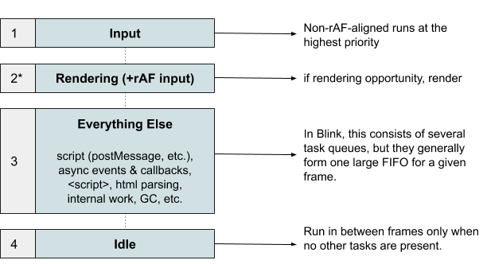

# Main-thread Scheduling API
For an overview, see: [Slides presented at TPAC 2018](https://docs.google.com/presentation/d/12lkTrTwGedKSFqOFhQTsEdcLI3ydRiAdom_9uQ2FgsM/edit?usp=sharing)

Also this [talk from Chrome Dev Summit](https://youtu.be/mDdgfyRB5kg) covers the problem and larger direction.

## Motivation: Main thread contention
Consider a "search-as-you-type" application:

This app needs to be responsive to user input i.e. user typing in the
search-box. At the same time any animations on the page must be rendered
smoothly, also the work for fetching and preparing search results and updating
the page must also progress quickly. 

This is a lot of different deadlines to meet for the app developer. It is easy
for any long running script work to hold up the main thread and cause
responsiveness issues for typing, rendering animations or updating search
results.

This problem can be tackled by systematically chunking and scheduling main
thread work i.e. prioritizing and executing work async at an appropriate time
relative to current situation of user and browser. A Main Thread Scheduler
provides improved guarantees of responsiveness.

## Improving User Experience Through Better Scheduling

As the [example above](#motivation_main_thread_contention) illustrates, modern
web apps are complex and often consist of multiple ongoing operations. These
tasks may also have varying degrees of importance in terms of how they affect
user experience. For example, consider a tile-based app like Maps. The app
might load all of the tiles in the viewport and and some just outside. From the
user's perspective, however, it's more important to load the tiles in the
viewport than those that are off-screen. But at the same time, apps are dynamic
and user input may change the relative importance of tasks at any moment. In
Maps, the relative importance changes when the user starts panning, with tiles
that are just outside the viewport becoming more important.

Determining which tasks should run at a given moment is the primary function
of a scheduler, and userspace schedulers have been designed for this very
purpose (see also [userspace scheduler case studies](#UserspaceSchedulers.md)).
To give the responsiveness guarantees that apps require however, improved
scheduling APIs are needed.

There are two approaches we could take to improve scheduling on the Web, both
of which we intend to explore.

First, we could incrementally improve userspace schedulers by exposing *better
scheduling primitives*. Existing userspace schedulers have been successful in
improving user experience, but are limited by gaps in
[knowledge](UserspaceSchedulers.md#4a-knowledge) and
[coordination](UserspaceSchedulers.md#4b-coordination). Shipping new scheduling
primitives that fill these gaps can further enable Javascript / userspace
schedulers to succeed. See [Low Level Scheduling APIs](#LowLevelAPIs.md) for a
list of APIs we are currently exploring.

Second, and the focus of the rest of this document, is to build a native
scheduler in the browser that is directly integrated into the browser's event
loop.

## A Native Scheduling API

Providing a native scheduler in the Platform has several advantages:
 1. **Userspace Coordination**: Userspace schedulers are fundamentally limited
by their *boundaries*, which is to say userspace schedulers are only effective
for the tasks they have control over. If multiple entities are sharing the main
thread, i.e. app, framework, 3P code, then schedulers are limited without
coordination. The browser is cventrally positioned to coordinate scheduling
between everything sharing the main thread.

 2. **Browser Coordination**: A common agreed upon library could remedy (1)
    (assuming everyone agrees on a single library), but there is still a
coordination problem with browser tasks, e.g. fetch responses, internal tasks,
etc. A native scheduler could provide coordination among **all** tasks sharing
the main thread.

 3. **A Unified API**: There is currently has a disparate set of scheduling
APIs, making it onerous for developers to write scheduling code. It takes
expert knowledge of the Browser's event loop to write scheduling code, and
adding more low-level APIs will likely exacerbate this. Creating a unified
native scheduling API can alleviate this.

### Priority-Based Web Scheduling and Current Model

Schedulers commonly use some notion of **priority** to decide which task should
run next.

The Web Platform currently exposes a few priorities through a
disparate set of APIs. `requestAnimationFrame()` is used to run tasks with
frame-timing; `requestIdleCallback()` is used to post background work that can
be potentially starved indefinitely; and `setTimeout(0)` or `postMessage()` are
used to run tasks at *default* priority between frames.

Browsers have some control over how tasks of different types are scheduled ---
for example, input tasks may be prioritized --- but, generally most tasks run
at the same priority level.

In Chromium, for example, the per-document priority model looks like the
following:

The userspace schedulers that apps like Maps and frameworks like React use must
operate *within* this priority system.

For example, the React scheduler runs between frames using `postMessage()`:

This illistrates the coordination issue described above: the tasks within the
scheduler cannot be effectively ordered with tasks outside of the scheduler.

### Proposed API Surface

#### Priorities

The native scheduler's foundation is a set of shared priorities that can be
used for tasks posted directly through the scheduler, i.e.
`scheduler.postTask()`, and for indirect tasks such as `<script>` tag
processing and `fetch()` completions. Much of the initial API version will
focus on how to expose these priorities to developers, and what the semantics
of the priorities are (see also [this
doc](https://docs.google.com/document/d/1AATlW1ohLUgjSdqukgDx3C0P6rnJFgZavmKoZxGb8Rw/edit?usp=sharing)
for an in-depth discussion of priority systems and semantics).

#### Additional Requirements

#### Examples

## Further Reading

* [MVP Proposal](https://docs.google.com/document/d/1AATlW1ohLUgjSdqukgDx3C0P6rnJFgZavmKoZxGb8Rw/edit?usp=sharing)
* [Priority-Based Web Scheduling](https://docs.google.com/document/d/1AATlW1ohLUgjSdqukgDx3C0P6rnJFgZavmKoZxGb8Rw/edit?usp=sharing)
