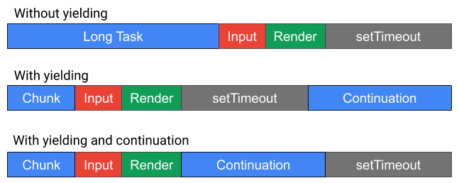

# Main Thread Scheduling: Yield and Continuation

For an overview of the larger problem space, see [Main Thread Scheduling API](README.md).

## The Problem

To keep apps responsive, developers break up long tasks into smaller chunks,
periodically yielding to the event loop so that high priority work like input
or rendering can be serviced.

One strategy is to statically chunk work ahead of time and schedule it with
`setTimeout` or `postMessage`. But this is often difficult in practice, e.g.
it's hard to get the chunk size right, and that can change depending on the
underlying hardware.

A more common strategy is to run for some amount of time and yield when
appropriate, e.g. if
[isInputPending()](https://github.com/WICG/is-input-pending) returns true, if a
frame is expected, or if some amount of time has passed (e.g. 50 ms). Then, the
task is *rescheduled* (e.g. with `setTimeout`), which we refer to as a
*continuation*.

The problem is that there is significant **overhead** due to letting other
tasks run in-between the task and its continuation.

At the time the initial task started running, there may have been other tasks
in the UA's task queues (e.g. other `setTimeouts`), or tasks may get queued
during its execution (e.g. a `fetch` completion). The continuation has to wait
for all of those queued tasks to run, which can add significant overhead when
yielding.

Visually, the overhead might look something like this:



This overhead can **disincentivize script from yielding**, which can lead to
unresponsiveness in apps.

## Proposal

We propose adding a scheduling primitive, `scheduler.yield()` for supporting
yielding to the event loop, such that a continuation task will run after the UA
services higher priority work, *before* tasks of the same priority are allowed
to run.

We are proposing a Promise-based API for the ergonomic benefit of async-await.

The basic usage is to provide no arguments to `scheduler.yield()`. This returns
a Promise which will be resolved after the event loop services higher priority
work.

```javascript
async function doWork() {
  while(true) {
    let hasMoreWork = doSomeWork();
    if (!hasMoreWork) return;
    await scheduler.yield();
  }
```

This works well with other primitives that help script determine when to yield:

```javascript
async function doWork() {
  while(true) {
    let hasMoreWork = doSomeWork();
    if (!hasMoreWork) return;
    if (!navigator.scheduling.isInputPending()) continue;
    await scheduler.yield();
  }
```

There is an optional `priority` argument that works with the [prioritized
postTask API](PrioritizedPostTask.md). If this argument is provided, the
Promise is resolved after tasks of the given priority and higher run.
```javascript
let continuation = scheduler.yield('high');
```

## Further Reading / Viewing

 * WebPerfWG F2F Presentation - June 2019 [[slides](https://docs.google.com/presentation/d/1GUB081FTpvFEwEkfePagFEkiqcLKKnIHkhym-I8tTd8/edit#slide=id.g5b43bd1ecf_0_508), [video](https://www.youtube.com/watch?v=eyAW4FuSgyE&t=14387)]: `scheduler.yield()` and `scheduler.postTask()` are presented and discussed
 * Detailed [Scheduling API Proposal](https://docs.google.com/document/d/1xU7HyNsEsbXhTgt0ZnXDbeSXm5-m5FzkLJAT6LTizEI/edit#heading=h.iw2lczs6xwe6)
