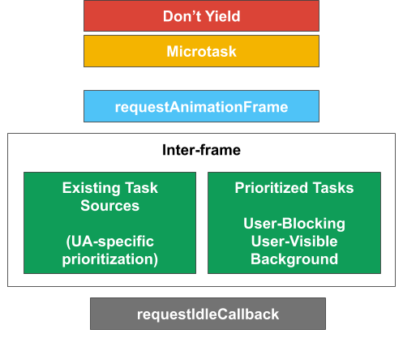

# Scheduling APIs: Prioritized postTask API

**Author**: Scott Haseley
<br/>
**Participate**: [Issue Tracker](https://github.com/WICG/scheduling-apis/issues)
<br/>
**Specification**:[Scheduling APIs specification](https://wicg.github.io/scheduling-apis/)

For an overview of the larger problem space, see [Scheduling APIs](../README.md).

## Summary

[Userspace tasks](../misc/userspace-task-models.md) often have varying degrees
of importance (related to user experience), but the Platform lacks a unified
API to schedule and control prioritized work; `scheduler.postTask()` provides
this functionality.

## The Problem

Scheduling can be an important tool for improving website performance and user
experience, playing a role in both responsiveness and user-perceived latency.
By breaking up long tasks into smaller tasks, or *chunks*, the page can remain
responsive if the app yields to the event loop between tasks. Running high
priority work sooner can improve user experience by minimizing user-perceived
latency of the associated interaction. [Userspace
tasks](../misc/userspace-task-models.md)&mdash;or groups of related
tasks&mdash;often have an associated priority, i.e. not all work has the same
importance. For example, rendering in-viewport content is more important than
rendering content that is just out of the viewport but might be seen soon. A
task's priority is also subject to change, e.g. in response to user input.

[Userspace schedulers](../misc/userspace-schedulers.md) often manage these
tasks&mdash;prioritizing and executing work asynchronously at an appropriate
time relative to the current situation of the user and browser. These
schedulers use an internal notion of priority to order execution of tasks they
control, but this has limited meaning since they do not control all tasks on
the page. Apps can consist of 1P, 1P library, 3P, and (one or more) framework
script, all of which compete for the thread. At the same time, the browser has
tasks to run on the thread, such as async work (e.g. `fetch()` and IndexedDB
tasks) and garbage collection.

### Existing Priorities

One problem is that developers have little control over the priority that their
tasks run within the browser, as the Platform only exposes a few priorities,
either explicitly or implicitly through a disparate set of APIs. UAs have the
ability to prioritize tasks on a
*[per-task-source](https://html.spec.whatwg.org/multipage/webappapis.html#task-source)
basis*, but there is no way for developers to differentiate priority between
tasks of a given task source.

The current state of prioritization in the browser looks something like this:


The first two&mdash;*microtask* and *don't yield*&mdash;are generally
antithetical to scheduling and the goal of improving responsiveness. They are
implicit priorities that developers can and do use.

`requestAnimationFrame`, which was designed for animations, is used (perhaps
abused) by userspace code to gain higher priority, since rendering is often
prioritized by UAs. Scheduling work at this "priority" has the disadvantage of
incurring extra overhead caused by running the rendering lifecycle updates
(they may early-out, but this is still more heavy-weight than may be needed if
not updating DOM). rAF runs during the [update the
rendering](https://html.spec.whatwg.org/multipage/webappapis.html#update-the-rendering)
step of the event loop processing model, and it is up to the UA to determine
whether or not there is a rendering opportunity which will result in rAF to
run.

Idle callbacks essentially run when there is no other work that can be done,
subject to rules about when an idle period can begin. This can be a good, albeit
complicated scheduling tool, but is not a sufficient expression of priority for
what app developers need, and it does not support changing priority.

Everything else, such as `setTimeout`, `postMessage` and `fetch` completions
run in between rendering opportunities (labeled as *inter-frame* here). The
browser has flexibility to prioritize between task sources, but not necessarily
visibility into task importance.

### Lack of a unified API

Another problem here is that there is no unified scheduling API. Instead,
developers have had to resort to various hacks, such as using [postMessage to
get around setTimeout(0)'s delay](https://dbaron.org/log/20100309-faster-timeouts),
or using rAF to gain higher priority. This complicates code, is onerous for
developers to learn and write, and can have negative performance effects (e.g.
gratuitous rendering lifecycle updates).

## Goals and Non-goals

### Goals

 * To enable developers to schedule, control, and interact with prioritized
   tasks using modern primitives like promises and `AbortSignal`s

 * To enable the browser to make better internal scheduling decisions by being
   aware of userspace task priorities

 * To create a set of priorities that is shared across all parts of an
   application (e.g. 1P, 3P, framework code)

### Non-goals

 * To enable an arbitrary number of priorities (see the
   [FAQ](#frequently-asked-questions) below)

 * To replace every userspace scheduler. While userspace schedulers have a lot
   in common with each other, the details tend to differ, e.g. number of
   priorities, how microtasks are used, chunk size, starvation prevention, etc.
   While we hope userspace schedulers can leverage `postTask()`, it won't
   replace all of them&mdash;at least not immediately. The first version of
   `postTask()` represents our MVP, and we fully expect it to evolve over time.

 * To create a total ordering on tasks within the browser. It may be
   advantageous to specify the priorities of some task sources (e.g. timers) to
   help meet developer expectations, but this API does not specify how UAs
   should schedule other task sources with respect to `postTask()` tasks.

 * To specify the relationship between `postTask()` tasks and rendering.
   `postTask()` tasks run in between frames, and the relationship between how
   many `postTask()` tasks can run between frames is out-of-scope for this
   proposal. See also [this issue](https://github.com/WICG/scheduling-apis/issues/9).

## Proposal

To address these problems, we propose adding a unified prioritized task
scheduling API, `postTask`, that allows developers to schedule work
with a set of standard priorities directly through a native scheduler.

### Priorities

At the core of this API is a set of priorities. We have selected an initial
minimal set of *semantically significant* priorities. Semantically meaningful
naming helps developers understand when it is appropriate to use a given
priority and enable easier coordination, and there is precedent in other
systems. Similar priorities (and a similarly small set) can be found in other
platforms like Apple's
[QoSClass](https://developer.apple.com/documentation/dispatch/dispatchqos/qosclass)
and Chromium's internal [browser task
queues](https://cs.chromium.org/chromium/src/content/browser/scheduler/browser_task_queues.h).

**Note**: The number of priorities can be extended if there are use cases not
covered by this minimal set of priorities. We also understand that apps may have
finer-grained app-specific priorities, and are considering [additional
APIs](#post-mvp-api-areas-of-exploration) to support these.



1. **user-blocking**: User-blocking tasks are tasks that block a user from
   interacting with and using the app. This could be (chunked) work that is
   directly in response to user input, or updating in-viewport UI state.

2. **user-visible**: User-visible tasks are those that will be visible to the
   user, but either not immediately or do not block the user from interacting
   with the page. These tasks have either a different importance or
   timescale than user-blocking tasks.

   **Note**: this is the default `postTask` priority if a priority is not
   specified.

3. **background**: Background tasks are low priority tasks that are not
   time-sensitive and not visible to the user.

#### Scheduling between prioritized tasks and other task sources

The API does not specify how UAs should schedule between prioritized tasks
(`postTask` tasks) and other task sources. It likely makes sense to schedule
some task sources (e.g. timers) at a priority lower than user-blocking, but we
want to leave room for UAs to experiment with prioritization. These semantic
priorities can be used as further information to make scheduling decisions with
respect to choosing which task source to select a task from.

We may find the need to spec the priorities of other task sources in the
future, e.g. to improve the API and meet developer expectations, but that is
out of scope for this proposal.

#### Scheduling between prioritized tasks

Another question is how the browser should schedule between prioritized tasks.
Semantically, the priorities are ordered based on impact on user experience,
with `user-blocking` being the highest priority, `user-visible` being the next
highest, and `background` being the lowest. So intuitively, selecting lower
priority work over higher priority work would degrade user experience. But
running tasks in strict priority order can lead to starvation of lower priority
tasks, which may or may not be desirable.

**Note**: One assumption here is that the priorities are being used for their
intended purposes, which the API cannot guarantee is the case. Preventing
intentional or unintentional misuse of priorities is a non-goal for the first
version of the API, though we are exploring solutions in the space (see the
[FAQ](#frequently-asked-questions) below).

We have a few options here:

1. Use fixed priorities: user-blocking > user-visible > background. This option
   provides the most guarantees to developers and is the easiest to understand
   why a certain task was selected to run, which can be invaluable in debugging.

2. Use fixed priorities, but expose anti-starvation mechanisms to developers.
   This is an extension of (1) which exposes primitives to developers aimed at
   preventing indefinite starvation. This could be as simple as a timeout or
   something more complicated like task aging.

3. Allow UAs freedom to schedule between different priorities as they see fit.
   This option gives browsers the most flexibility at the cost of developer
   expectations/guarantees.


Our current opinion is that using fixed priorities (option 1) is better for web
developers because of the guarantees it provides, however we also recognize
that the need for some kind of anti-starvation is highly likely (meaning option
2 is a likelier end state). We think that we'll have more insight in this
regard as usage of the API increases.

### API Shape

The basic API shape is similar to other async APIs such as `fetch`:
```javascript
// The default priority is 'user-visible'.
const promise = scheduler.postTask(myTask);
```

`postTask` also takes a number of optional arguments, including specifying the
priority:
```javascript
const promise = scheduler.postTask(myTask, {priority: 'user-blocking'});
```

The Promise that `postTask` returns is resolved with the callback's return value:
```javascript
function myTask() {
  return 'hello';
}

(async function() {
  const res = await scheduler.postTask(myTask, {priority: 'background'});
  console.log(res) // prints 'hello'.
})();
```

#### Controlling Posted Tasks

The API supports two operations that modify a task once it has been queued:
cancellation and changing priority. The API leverages a `TaskController` that
supports `AbortController` operations (`abort()`) and an additional
`setPriority` operation. The following example demonstrates controlling tasks
with a `TaskController`:

```javascript
const controller = new TaskController({priority: 'user-blocking'});

// |signal| is an instance of a TaskSignal, which has read-only properties for
// the aborted state and current priority.
const signal = controller.signal;

console.log(signal.priority);  // logs 'user-blocking'.
console.log(signal.aborted);   // logs 'false'.

scheduler.postTask(doWork, {signal});

...

// Change the priority to 'background'.
controller.setPriority('background');

// Cancel the pending task.
controller.abort();
```

The real power of the controller-based API comes with sharing a signal between
multiple async tasks, possibly between disparate APIs, and acting on them en
masse. For example, a `TaskSignal` can be passed to `fetch` and can be used to
cancel pending postTask tasks and ongoing fetches.

```javascript
const controller = new TaskController({priority: 'user-blocking'});
const signal = controller.signal;

function doWork() {
  let task;
  let tasks = [];

  task = scheduler.postTask(subtask1, {signal});
  tasks.push(task);

  task = scheduler.postTask(subtask2, {signal});
  tasks.push(task);

  task = fetch(url, {signal});
  tasks.push(task);

  return Promise.all(tasks);
}

scheduler.postTask(doWork, {signal});

...

// Cancel all of the work created in the doWork task.
controller.abort();
```

**Note**: The example above also works if using an `AbortController` rather than
a `TaskController`, which means `postTask` can be easily integrated into
existing code that uses `AbortSignals`. A full `TaskController` is only needed
if priority might need to be changed, otherwise an `AbortController` suffices.
In the future, we plan to explore using `TaskSignal` in other existing APIs
to express priority and communicate priority change.

##### What happens when both a signal and priority are provided?

Consider the following example:

```javascript
const controller = new TaskController({priority: 'user-blocking'});
const signal = controller.signal;

scheduler.postTask(() => {
  scheduler.postTask(foo, {signal, priority: 'background'});
});
```

What is the priority of `foo`?

There are three options here:

1. The provided priority overrides the signal's priority (`foo` has `'background'` priority)
2. The signal's priority overrides the provided priority (`foo` has `'user-blocking'` priority)
3. An error is thrown

We are proposing option (1): if both a signal and a priority are provided to
`postTask`, the **priority overrides the signal**.

This enables something we call _partial signal inheritance_. In this case, the
`TaskSignal` is treated as if it were an `AbortSignal`&mdash; the _abort_ part of
the signal is inherited by `foo`, and the priority acts as an _override_.

This approach enables use cases that involve posting lower priority dependent
work, for example logging or cleanup work. We do note that there is a more
verbose way to handle this use case, which involves listening for the parent
signal's [`abort` event](https://developer.mozilla.org/en-US/docs/Web/API/AbortSignal/abort_event):

```javascript
const controller = new TaskController({priority: 'user-blocking'});
const signal = controller.signal;

scheduler.postTask(() => {
  // Priority change not needed.
  const subtaskController = new AbortController();
  const subtaskSignal = subtaskController.signal;

  // Listen for the parent task being aborted.
  signal.onabort = () => { subtaskController.abort(); };

  scheduler.postTask(foo, {subtaskSignal, priority: 'background'});
});
```

##### Listening for priority changes

Similar to how `AbortSignal` has an
[`abort` event](https://developer.mozilla.org/en-US/docs/Web/API/AbortSignal/abort_event)
to listen for a change in abort state, `TaskSignal` supports a `prioritychange`
event to listen for changes in priority. The event handler can be registered
using either the `addEventListener` method or `onprioritychange` property of a
`TaskSignal`. The previous priority can be read through the `previousPriority`
property of the associated event.

```javascript
const controller = new TaskController({priority: 'user-blocking'});
const signal = controller.signal;

// Method 1: using onprioritychange.
signal.onprioritychange = (event) => {
  const previousPriority = event.previousPriority;
  const newPriority = event.target.priority;
  console.log(`The priority changed from ${previousPriority} to ${newPriority}.`);
}

// Method 2: using addEventListener.
signal.addEventListener('prioritychange', (event) => {
  const previousPriority = event.previousPriority;
  const newPriority = event.target.priority;
  console.log(`The priority changed from ${previousPriority} to ${newPriority}.`);
});

controller.setPriority('background');
```

#### Posting Delayed Tasks

An optional `delay` parameter can be specified in the `postTask` options,
enabling posting prioritized, delayed work. This can, for example, be used to
implement custom anti-starvation logic in userspace schedulers.

Simple example:
```javascript
scheduler.postTask(delayedTask, {delay: 1000});
```

We use semantics similar to [DOM
timers](https://html.spec.whatwg.org/multipage/timers-and-user-prompts.html#timer-initialisation-steps):

1. Delayed tasks with same expiration time and same priority run in the order
   they were posted.

2. Delayed tasks are queued when their timer expires, not immediately run. This
   effectively means that tasks of the same priority that were *queued* before
   the timer expires will run first.

3. Like DOM timers, UAs are allowed to add a custom amount of additional delay.


**Note**: It's not clear at this point if we need to retain the *nesting level*
logic found in the timer initialization steps, and we omit it for now.

Example:

```javascript
scheduler.postTask(() => { console.log('C'); }, { delay: 10 });
scheduler.postTask(() => { console.log('A'); });
scheduler.postTask(() => { console.log('B'); });

// Prints 'A' 'B' 'C'.
```

## Post-MVP API Areas of Exploration

The API shape described above is the current MVP. The following are
extensions of the base API that are in various degrees of exploration:

 1. **Prioritizing Non-postTask Async Work**: While `postTask` allows
    developers to express priority of tasks they control, it does not allow
    them to express priority for other async work, like `fetch`, `<script>`,
    and IndexedDB. These tasks fall into the category of inter-frame tasks that
    browsers can prioritize by task source, but without knowledge of individual
    resource priority, it is difficult to make such decisions.

    We are interested in pursuing priorities for other tasks, but this is out of
    scope for this API.

 1. [**Propagating and Inheriting Priority**](post-task-propagation.md): A
    frequent request we see from developers is the desire to inherit or
    propagate the currently running task's priority.

 1. **Controlling 3P Script**: We are exploring some ideas to allow script to
    influence the priority of other script it imports, but this is in the very
    early stages of design. See also the [FAQ](#frequently-asked-questions)
    below.

 1. **App-specific priorities**: Some apps will have more priorities than
    `postTask` supports, e.g. they may wish to subdivide the 'user-visible'
    priority based on order of impact on user experience. We are currently
    [exploring](https://docs.google.com/document/d/1YpRsiOMmPrBOODpEvfrE-duvUcV8gIsDDaZPG7f27_Q/view)
    APIs to support this feature.

 1. **Async Job/Task Queue API**: Developers sometimes want the behavior that
    one task doesn't start until certain [yieldy async
    tasks](../misc/userspace-task-models.md#yieldy-asynchronous-tasks) complete.
    This currently involves tracking and blocking on promise resolution, but we
    are exploring ways to improve the ergonomics through additional APIs.

 1. **Coordinating DOM Reads/Writes**: Layout thrashing is a coordination
    problem that is addressed by libraries like
    [fastdom](https://github.com/wilsonpage/fastdom). Since scheduling in
    general and `postTask` specifically are aimed at solving coordination
    problems, it might be appropriate for `postTask` or a similar scheduling
    API to help solve this problem as well. This is also something we're
    exploring, but is in the very early stages.

## Frequently Asked Questions

### How many priorities should there be?

There is a tension between supporting every use case (someone will always need
the Nth + 1 priority), and making the priorities meaningful across the system. A
smaller set of priorities favors the latter, and there is a precedence for this
in successful frameworks like GCD (see
[QoSClass](https://developer.apple.com/documentation/dispatch/dispatchqos/qosclass)).

Developers that need more priorities can use the native ones to specify where
their tasks should run relative to other tasks in the system&mdash;based on how
they effect user experience&mdash;and use user-defined task queues or arrays to
multiplex the native priority. As mentioned above, we're exploring additional
APIs that aims to solve this problem natively.

### What about script that always uses the highest priority?

This is an important question and something we're actively exploring.
Rephrasing a bit, this is about how developers can express or control the
relative priorities of different actors on a page, e.g. 1P and 3P script.
For well-meaning actors, `postTask` enables coordination when everything on
the page has the same relative priority, or when priority can be communicated
between actors. However, for well-meaning actors that don't understand their
relative importance&mdash;which can change over time&mdash;`postTask` is not
sufficient for coordination.

In some cases, this can be solved by moving code off of the main thread. But
this isn't always practical or possible. We're actively exploring a more
lightweight solution and will publish an explainer soon.

### Is there a risk of priority inversions?

Priority inversions occur whenever higher priority work depends on lower
priority work, so simply by introducing priorities introduces this risk. But
the lack of preemption on the web creates a fundamentally different situation
compared to other platforms. The combination of priorities, mutually exclusive
access to resources (e.g. locks), and preemption necessitate a system-level
solution to priority inversions. But this is not the case on the web since
tasks are not preemptible.

There is, however, a risk of priority inversions in application code. Two
scenarios we have identified are:

 1. Explicitly yielding while holding onto a lock/resource
 1. Priority mismatches, e.g. yielding at the wrong priority or explicitly
    relying on the result of a lower priority task

Developers should be cautious when creating dependencies between prioritized
tasks and be sure not to hold onto (locked) resources when writing yieldy code.

A more in-depth exploration of this topic can be found
[here](../misc/priority-inversion.md).

### Will this API be available on workers too?

Yes, we plan to make this API available on workers as well
([WindowOrWorkerGlobalScope](https://html.spec.whatwg.org/multipage/webappapis.html#windoworworkerglobalscope-mixin)).

The main potential downside we considered is that the semantic priorities may
not be as applicable for workers, e.g. does `'user-blocking'` still apply? But
in cases where code is being offloaded to workers to keep the main thread free,
that work can still vary in degree of importance and effect on user experience,
so the semantic priorities can still be meaningful.

Enabling `postTask` on workers has other compelling advantages as well. First,
it will make porting any code that uses the scheduler simpler. Second,
integrating `postTask` priorities with other async APIs will then work
seamlessly on workers as well (e.g. `fetch` on workers).

## Alternatives Considered

### Off Main Thread

`postTask` is an incremental improvement to
[cooperative scheduling](https://www.w3.org/TR/requestidlecallback/), where main
thread work is chunked and prioritized, periodically yielding to the browser.

The main alternative to the cooperative scheduling approach involves moving
code *off* the main thread. While there has been a lot of exploration and
promising ideas in this area, this is often not a pragmatic choice for
developers. For example, latency can suffer because of the cost of thread hops
and serialization overhead [1]. And apps and frameworks have been investing
heavily in the cooperative scheduling model to great success (e.g. React
concurrent mode).

[1] [Conclusions from Off Main Thread & Worker Exploration](https://docs.google.com/document/d/1nu0EcVNC3jtmUVWL8Gs5eCj2p_984kamNhG2nS9gOC0/edit#)

### API Shape

The first version of this proposal was a task-queue-based API, but we changed
the API to its current form to fit better with the Platform and with existing
primitives, which is now an explicit [goal](#goals).

The proposal originally included the ability to pass arguments to the callback,
like in `setTimeout`, but was removed because modern JS supports arrow
functions, which obviates the need to pass them through `postTask` (see [this
issue](https://github.com/WICG/scheduling-apis/issues/18)).

## Security Considerations

**Note**: This section summarizes [this much longer exploration](../misc/post-task-security.md).

The main security concern is whether or not the API adds new surfaces to
perform side-channel attacks, specifically for same-process cross-origin
iframes. This might be a concern because `postTask`

1. exposes priorities, which influence the order in which tasks run
2. allows tasks to be posted with a delay

The two main attacks we consider here are whether `postTask` leaks any new
information through priorities, and  whether prioritized delayed tasks can be
used as a new high-resolution timing source.

**Information Leaks from Priorities**

There do not appear to be any new information leaks caused by this API,
specifically it doesn't appear possible for a frame to infer the priorities of
tasks running in other frames by staging a timing-based attack and exploiting
the ordering guarantees of the API.

Attackers can attempt to learn priorities of other tasks in the system by
queuing `postTask` tasks that are expected to run consecutively, e.g. two
`'user-blocking'` tasks, and determining if they did run consecutively. If they
didn't, then the UA chose another task in between. But since the UA is [free to
choose between prioritized and unprioritized task
sources](#scheduling-between-prioritized-tasks-and-other-task-sources), the
attacker can't know what type of task type was run. The same applies to posting
consecutive tasks of priority N and N-1.

**Potential for high-res timing**

Since `postTask` has a delay parameter, there is concern that it can be used to
implement a high-resolution timer. But `postTask`'s delay parameter follows
that of `setTimeout`'s, where delay is expressed in whole milliseconds (the
minimum non-zero delay being 1 ms), and there is no guarantee that tasks
will run exactly when the delay expires since tasks are queued when the delay
expires, and UAs can add additional delay. This makes it unlikely that
`postTask` can be used as a high resolution timing source.

## Further Reading / Viewing

 * WebPerfWG Presentation on Updated API Shape &ndash; November 2019 [[slides](https://docs.google.com/presentation/d/1yLkP41BQlJw-N-6dvbEkC8JhXm8sYdlXnAORDHcBKiQ/edit?usp=sharing), [video](https://youtu.be/1B6sFgbIPaU)]
 * BlinkOn 11 Presentation &ndash; November 2019 [[slides](https://docs.google.com/presentation/d/1-QOXjSGyL-taTY4XH7yc-E7KIDE023WSs_GQ6gIoQ8I/edit?usp=sharing), [video](https://www.youtube.com/watch?v=5ALpRlsqdTE)]
 * WebPerfWG F2F Presentation &ndash; June 2019 [[slides](https://docs.google.com/presentation/d/1GUB081FTpvFEwEkfePagFEkiqcLKKnIHkhym-I8tTd8/edit#slide=id.g5b43bd1ecf_0_508), [video](https://www.youtube.com/watch?v=eyAW4FuSgyE&t=14387)]: `scheduler.yield()` and `scheduler.postTask()` are presented and discussed
 * [`postTask` Design Doc](https://docs.google.com/document/d/1Apz-SD-pOagGeyWxIpgOi0ARNkrCrELhPdm18eeu9tw/edit?usp=sharing)
 * Implementing Subtasks using Signal-based postTask ([doc](https://docs.google.com/document/d/1BPMgjmp3v5zM5zm6AODmmSi10jXAA4VhuQJlhndfHc8/edit?usp=sharing))
 * Detailed [Scheduling API Proposal](https://docs.google.com/document/d/1xU7HyNsEsbXhTgt0ZnXDbeSXm5-m5FzkLJAT6LTizEI/edit#heading=h.iw2lczs6xwe6) (previous API shape)
 * [MVP Proposal](https://docs.google.com/document/d/1AATlW1ohLUgjSdqukgDx3C0P6rnJFgZavmKoZxGb8Rw/edit?usp=sharing)
 * [Priority-Based Web Scheduling](https://docs.google.com/document/d/1AATlW1ohLUgjSdqukgDx3C0P6rnJFgZavmKoZxGb8Rw/edit?usp=sharing) dives into various scheduling priority systems
