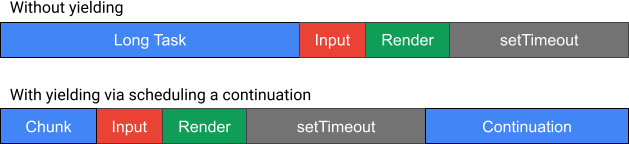

# `scheduler.yield()`

**WARNING: This explainer is out of date.** The API no longer supports directly
specifying the priority and abort behavior, but rather inherits this state from
the current task. See https://wicg.github.io/scheduling-apis/#dom-scheduler-yield
for the up-to-date API and behavior.

## Authors

- [Scott Haseley](https://github.com/shaseley)

## Participate

- [Issue tracker](https://github.com/WICG/scheduling-apis/issues)

## Table of Contents

<!-- START doctoc generated TOC please keep comment here to allow auto update -->
<!-- DON'T EDIT THIS SECTION, INSTEAD RE-RUN doctoc TO UPDATE -->

- [Introduction](#introduction)
- [Goals](#goals)
- [Non-Goals](#non-goals)
- [User Research](#user-research)
- [`scheduler.yield()`](#scheduleryield)
  - [Controlling Continuation Priority and Abort Behavior](#controlling-continuation-priority-and-abort-behavior)
- [Key Scenarios](#key-scenarios)
  - [Use With `isInputPending()`](#use-with-isinputpending)
- [Detailed Design Discussion](#detailed-design-discussion)
  - [Task Continuation Scheduling Behavior](#task-continuation-scheduling-behavior)
    - [Taking Priority Into Account](#taking-priority-into-account)
    - [Preventing Task Starvation by Continuations](#preventing-task-starvation-by-continuations)
    - [Continuation Guarantees](#continuation-guarantees)
    - [Processing Model Sketch](#processing-model-sketch)
  - [Priority & Abort Propagation Behavior](#priority--abort-propagation-behavior)
    - [Extent of propagation](#extent-of-propagation)
- [Considered Alternatives](#considered-alternatives)
  - [Alternative Designs](#alternative-designs)
    - [`postTask()` + Generator Functions](#posttask--generator-functions)
    - [A New JavaScript Language Feature](#a-new-javascript-language-feature)
    - [`postTask()` + Task Context: Narrowly Scoped Yield](#posttask--task-context-narrowly-scoped-yield)
    - [Naming](#naming)
- [Open Questions](#open-questions)
- [Future Work](#future-work)
  - [Exposing the Current Scheduler State](#exposing-the-current-scheduler-state)
  - [Alternative Yielding Semantics](#alternative-yielding-semantics)
  - [Priorities on `fetch()` and Other Async Tasks](#priorities-on-fetch-and-other-async-tasks)
- [Stakeholder Feedback / Opposition](#stakeholder-feedback--opposition)
- [References & Acknowledgements](#references--acknowledgements)
- [Self-Review Questionnaire: Security and Privacy](#self-review-questionnaire-security-and-privacy)
- [Appendix](#appendix)
  - [Event Loop Scheduling](#event-loop-scheduling)

<!-- END doctoc generated TOC please keep comment here to allow auto update -->

## Introduction

Long tasks (JavaScript) can lead to poor responsiveness by blocking the main
thread from handling inputs or delaying the resulting UI update. Developers can
mitigate this by decreasing task lengths, either by doing less work or by
breaking up long tasks. This work focuses on the latter.

There are typically two approaches to breaking up long tasks:

1. Break long tasks into smaller pieces, e.g. at selected function boundaries,
   scheduling the pieces as subtasks with `scheduler.postTask()` or another
   task scheduling API
2. Periodically or strategically yield to the event loop by scheduling a _task
   continuation_ (continuation)<sup>[1](#footnote1)</sup>, again with
   `scheduler.postTask()` or similar

Subtask boundaries are typically selected at design time based on some
criteria, e.g. profiling. The yield/continuation pattern can be used either
at design time or dynamically at run time, e.g. yielding based on
`isInputPending()` and/or elapsed task time. It can also be easier to integrate
into existing tasks or functions because potentially less rearchitecting is
needed.

Scheduling a continuation using current APIs typically has poor ergonomics
because intuitively one wants to pause/resume the current task &mdash; not
schedule a new task. It can also incur a performance penalty if arbitrary
JavaScript runs between yield and continuation, e.g. 3P scripts taking over
the thread if 1P code yields or non-framework code running if framework code
yields, e.g. during a rendering update<sup>[2](#footnote2)</sup>:

<br/>



<div style="font-size:90%">
<strong>With and without yielding via continuation.</strong> Without yielding,
input is delayed leading to poor responsiveness. Responsiveness is improved by
yielding, but the yielding task's end-to-end latency is longer due to
another task running before the continuation.</div><br/>


To improve the situation, we propose a new API designed for the
yield/continuation pattern. Developers can `await scheduler.yield()` to break
up long tasks, giving the UA an opportunity to run higher priority work, e.g.
input. To mitigate yielding performance penalty concerns, UAs prioritize
`scheduler.yield()` continuations over tasks of the same priority or similar
task sources.

<br/>


<div style="font-size:90%">
<strong>Yielding via `scheduler.yield()`.</strong> `scheduler.yield()`
prioritizes continuations, improving the yielding task’s end-to-end latency vs.
the continuation-scheduling method.</div><br/>

<div style="font-size:90%">
<a name="footnote1"><sup>1</sup></a> The term "continuation" is a bit
overloaded, e.g. microtasks are often referred to as (promise) continuations.
In this document we refer to the concept of pausing and resuming a JavaScript
task as a task continuation, or continuation for short, with no specific
scheduling semantics.

<a name="footnote2"><sup>2</sup></a> Note that scheduling tasks ahead of time
(in bunches) minimizes this risk since the tasks are queued around the same
time.
</div>

## Goals

**TODO**: add a reference for the data after summarizing and publishing
analysis.

Our primary goal is to facilitate improving responsiveness on the web. Long
tasks contribute to poor responsiveness in two primary ways.

First, long tasks can block the UA from handling pending input because [JS
tasks are
non-preemptable](https://developer.mozilla.org/en-US/docs/Web/JavaScript/EventLoop#run-to-completion).
A recent analysis of traces captured from Chrome on Android users showed
script-heavy input-blocking long tasks contributing to slow interactions. Of
the slow interactions (> 200 ms) analyzed, 18.76% had a JS-heavy (> 100 ms)
long task blocking input (queuing time > 100 ms). These long tasks consisted of
all manner of script: `<script>` execution, timers, fetch completion,
IndexedDB, etc.

Second, long input tasks (event handlers) can block users from quickly seeing
the initial response to an interaction. In the same analysis, we found ~10% of
slow interactions had inputs with > 100 ms of JavaScript and 8% had at least
one JS handler > 100 ms.

Yielding to break up long tasks or yielding if
[`isInputPending()`](https://wicg.github.io/is-input-pending/) is `true` can
mitigate the input-blocking long task problem. Yielding within event handlers
after initial processing can help mitigate issues caused by the long processing
time.

Our specific API goals are:
1. Enable UAs to run input and any higher priority work between yield and
   continuation

1. Provide a performance advantage for using `scheduler.yield()`, i.e. reduce
   the end-to-end task latency overhead of yielding via current methods

These are discussed in depth in the [design section](#detailed-design-discussion).

## Non-Goals

1. It's a non-goal to provide developers with control or hints over what
   specifically is permitted to run when yielding. This might be something to
   consider as a follow-up if compelling use cases arise.

1. We don't wish to create a total ordering on event loop tasks or break the
   [UA-specific task prioritization](#event-loop-scheduling) afforded by the
   event loop scheduling specification

1. While this API [introduces](#priority--abort-propagation-behavior) some
   amount of signal/priority propagation, it's a non-goal to implement
   automatic signal/priority propagation for all async tasks, e.g.
   automatically propagating task priority through `fetch()` or other async
   tasks. We think this is an interesting area of future work, but outside the
   scope of this proposal.

## User Research

No user research was performed specifically for this proposal, but there have
been studies on input latency in computing, some of which is discussed in [this
event-timing issue](https://github.com/w3c/event-timing/issues/118).

## `scheduler.yield()`

`scheduler.yield()` can be used in any context to yield to the event loop by
awaiting the promise it returns. The task continuation &mdash; the code that
runs as a microtask when the returned promise is resolved &mdash; runs in a new
browser task and gives the browser a scheduling opportunity.

```js
async function task() {
  doWork();
  // Yield to the event loop and resume in a new browser task.
  await scheduler.yield();
  doMoreWork();
}

// Schedule the long but yieldy task to run. scheduler.yield() can be used to
// break up long timers, long I/O callbacks, etc.
setTimeout(task, 100);
```

### Controlling Continuation Priority and Abort Behavior

Like `scheduler.postTask()` tasks, `scheduler.yield()` can have an associated
priority. The priority can either be inherited &mdash; inferred from the current
task context &mdash; or specified directly.

Similarly, the continuation can be aborted by passing or inheriting the current
signal. This can be useful, for example, if ongoing work is no longer necessary
and should halt in response to user input, e.g. clicking a cancel button.

Specifying a priority for the continuation:

```js
async function task() {
  while (stillMoreWorkToDo()) {
    doChunkOfWork();
    // This task will yield to tasks of higher priority than "background", but
    // will resume before other pending "background" tasks.
    await scheduler.yield({priority: "background"});
  }
}
```

Inheriting both priority and abort from the current task:

```js
async function task() {
  while (stillMoreWorkToDo()) {
    doChunkOfWork();
    // Inherit both the priority and abort components from the current task,
    // i.e. use the signal it was scheduled with. If the signal is aborted
    // before resuming, the promise returned by yield() will be rejected.
    await scheduler.yield({signal: "inherit"});
  }
}

const controller = new TaskController("background");
scheduler.postTask(task, {signal: controller.signal});
```

It's also possible to inherit only the priority or abort component:

```js
async function task() {
  while (stillMoreWorkToDo()) {
    doChunkOfWork();
    // Inherit only the priority from the current task, ensuring the task
    // completes and is not aborted.
    await scheduler.yield({priority: "inherit"});

    // or

    // Inherit the abort component but override the priority, e.g. to run the
    // continuation at a lower priority but abort the work if the user cancels
    // the operation.
    await scheduler.yield({signal: "inherit", priority: "background"});
  }
}
```

**Note**: The default behavior &mdash; whether or not to inherit by default
&mdash; is an [open question](#open-questions).

## Key Scenarios

### Use With `isInputPending()`

`scheduler.yield()` can be used in conjunction with `isInputPending()` to
improve responsiveness issues caused by long input-blocking tasks. In the
following example, the function yields when detecting pending input. If UAs
treat input and the resulting rendering as higher priority than the yield
continuation (recommended), the input queuing time would be at most the chunk
size.

```js
async function task() {
  while (stillMoreWorkToDo()) {
    doChunkOfWork();
    if (navigator.scheduling.isInputPending()) {
      await scheduler.yield();
    }
  }
}
```

Note that long tasks can still interfere with other tasks or other agents
sharing an OS thread, and in some cases `isInputPending()` [might return false
negatives](https://wicg.github.io/is-input-pending/#privacy-and-security), so
yielding only when there is pending input isn't recommended. But minimally
yielding when `isInputPending()` returns `true` can improve responsiveness and
benefit users — especially for tasks that wouldn't otherwise yield.

## Detailed Design Discussion

### Task Continuation Scheduling Behavior

**What should be allowed to run between a task yielding and its continuation?**

Intuitively, we want **higher priority** work to run between yield and
continuation. Note this is semantically different from thread yielding APIs on
some other platforms, e.g.
[`sched_yield()`](https://man7.org/linux/man-pages/man2/sched_yield.2.html) on
Linux, where higher or equal priority tasks/threads might run. But the web with
JavaScript's [run-to-completion
semantics](https://developer.mozilla.org/docs/Web/JavaScript/EventLoop#run-to-completion)
is fundamentally different: long JS tasks can _indefinitely block input handling_
and regaining control of the thread may face _indefinite delays due to other
long tasks_. And for this reason developers can be hesitant to give up the main
thread, which is why we opt for different semantics.

But what constitutes higher priority work? This is challenging because
prioritization of non-`scheduler` tasks (e.g. timers) is [left up to the
UA](#event-loop-scheduling), which is a [non-goal](#non-goals) to change. And
in general there is a trade-off between UA scheduling flexibility and the
yieldy task's end-to-end latency: each yield point provides an opportunity for
the scheduler to run a task, but at the expense of the yielding task.

At one extreme, we could allow only a small number of well-defined task sources
to run, e.g. only the [user interaction task
source](https://html.spec.whatwg.org/multipage/webappapis.html#user-interaction-task-source)
(and implicitly the rendering steps, which occur after any task runs). This
would maximize the performance advantage of `scheduler.yield()` while still
allowing the UA to handle input. But this doesn't take into account the
priority of the yielding task, e.g. yieldy `"background"` tasks, and it might
be too inflexible for UAs.

At the other extreme, UAs could be given total discretion to choose the next
task, i.e. they could choose either the next task based on the [current
constraints](#event-loop-scheduling) or the oldest/highest priority pending
continuation. This gives UAs the most flexibility but gives sites the fewest
guarantees, potentially limiting the performance advantage [goal](#goals).

**Note**: _The following sections represent our current thinking on the design,
but this is subject to change as we learn more from experimentation and
discussions._

#### Taking Priority Into Account

There are two cases where we know the priority of the yielding task:
`scheduler.postTask()` and `requestIdleCallback()`. We think this information
should be used to determine what is considered higher priority.

#### Preventing Task Starvation by Continuations

There's a risk of continuations starving other tasks, particularly if
developers make tasks longer but yieldy or replace existing yielding mechanisms
with this API. In the worst case, an application could seem responsive but is
not actually making progress. To mitigate this, we think it's reasonable to
**bound the duration** of consecutive continuations before allowing tasks of
the same priority to run, e.g. schedule the next continuation as a normal task
after one second of recursive continuations.

#### Continuation Guarantees

This is a tricky trade-off: we think UAs should have scheduling flexibility and
yielding should have an advantage over the status quo. There are two broad
strategies we've considered:

1. **allowlist**: Allow tasks from a set of task sources to run between yield
   and continuation, minimally allowlisting the [user interaction task
   source](https://html.spec.whatwg.org/multipage/webappapis.html#user-interaction-task-source)

2. **denylist**: Disallow tasks from a set of task sources to run between yield and
   continuation, minimally including the typical ways developers schedule work,
   i.e. (self-directed) `postMessage()` and `MessageChannel`, `setTimeout()`, and
   `scheduler.postTask()` (taking into account priority).

Note that the approaches are roughly equivalent in that an allowlist can be
determined either explicitly or as the set of all task sources excluding the
denylist (or vice versa). The difference is that, assuming the lists are kept
small, the allowlist favors developer guarantees and a denylist favors UA
flexibility. The denylist approach also allows new task sources by default.

We're leaning towards the denylist approach with a small list, minimally
including task sources associated with APIs developers use to schedule tasks
(actual list TBD). We think it's important to allow UAs to experiment with
scheduling policies that improve user experience, while still providing some
guarantees to developers.

#### Processing Model Sketch

We'll flesh this out further as we work on a prototype and specification, but
the basic processing model looks something like the following.

**Setup**
- Create a continuation task queue for each `scheduler` priority. Its effective
  priority &mdash; the order it's chosen by the `scheduler` &mdash; is between
  priority and the next highest `scheduler` priority.

**`scheduler.yield()`**
1. If a priority is specified, use it. Otherwise, figure out the priority of
   the current task:
   1. `requestIdleCallback()` --> `"background"`
   1. `scheduler.postTask()` --> however it was scheduled
   1. Within a microtask --> get the
      [propagated priority](#priority--abort-propagation-behavior)
   1. Everything else --> `"user-visible"`
1. Queue a task in the _continuation task queue_ with _priority_ from 1
1. Return the promise that gets resolved when the _continuation task_ from 2 runs

**Event loop scheduling**:
If there are no pending _continuation tasks_, do nothing different. Otherwise,
UAs may choose:
1. The oldest task from any non-`scheduler` task source not in the `denylist`, or
1. The oldest task from any `denylist` source &mdash; if the next highest priority
   pending `scheduler` task is `user-visible` or lower, or
1. The oldest task with the highest _effective_ priority

**Note**: this is just a sketch and it's missing some details, e.g.
duration-based starvation mitigation and dynamic prioritization.

### Priority & Abort Propagation Behavior

Consider the following example:

```js
const controller = new TaskController({priority: "background"});
scheduler.postTask(async () => {
  while (hasWork()) {
    doSomeWork();
    // Should this abort if `stopButton` is clicked?
    // What priority are the continuations scheduled at?
    await scheduler.yield();
  }
}, {signal: controller.signal});

stopButton.onclick(() => {
  ...
  controller.abort();
  ...
}
```

Resuming after yielding conceptually continues an existing task, so it's
reasonable to associate the task properties (`TaskSignal`) with the
continuations. In other words, yielding doesn't fundamentally change the task's
properties. In simple cases, like the example above, propagating the
`TaskSignal` makes sense: the chunks of work are still `"background"` work and
aborting the task stops the processing.

But this might not always be what the developer wants, e.g. some operations
might need to be completed once started and not all tasks have a priority to
begin with, e.g. calling `scheduler.yield()` from `requestAnimationFrame`.

Since inheritance may or may not be desired, we think it makes sense to support
both signal inheritance and to allow signal/priority to be specified as
options (the default is an [open question](#open-questions)).

To give full control over specifying inheritance, both the `signal` and
`priority` options support an `"inherit"` keyword:
 - `{signal: "inherit"}`: inherit the signal the task was scheduled with
 - `{signal: "inherit", priority: <priority>}`: inherit the signal but override
    the priority, enabling inheritance of only abort
 - `{priority: "inherit"}`: inherit only the priority.

#### Extent of propagation

There is a question of to what extent we should propagate priority/abort. In
the previous example, `scheduler.yield()` was always invoked either in the
`postTask()` callback or `yield()` microtask. But within async functions, we
can easily switch in and out of this _`scheduler` context_, for example:

```js
async function task() {
  // In the `postTask` callback.
  doWork();
  // Still in the `postTask` callback since we ran a sync function.
  await scheduler.yield();
  // In the yield microtask, i.e. the microtask checkpoint of the task that resolved
  // the yield() promise.
  let data = await fetch(url);
  // Now we've lost the scheduler context. We're in the fetch microtask, i.e. the
  // microtask checkpoint after running a network task to resolve the fetch.
  processData(data);
  // We're still in the fetch microtask -- but what priority do we yield at?
  await scheduler.yield();
}

scheduler.postTask(task, {signal: someSignal});
```

The scenario above is complicated, but likely not uncommon. Perhaps ideally the
`TaskSignal` would be threaded through the whole task &mdash; including the
`fetch()` &mdash; but extending a (main thread) scheduling priority to async
APIs is future work.

For `scheduler.yield()`'s continuation, we have three options:
 1. Require manual propagation, i.e. don't implement `{signal: "inherit"}`
 1. Stop propagating when we lose the `scheduler` context, after the `fetch` in
    the previous example
 1. Propagate the task's signal to all calls to yield within the async task,
    even if we've lost the `scheduler` context due to hopping through a
    different browser task, e.g. `fetch()` completion

We eliminated option 2 because it is brittle and confusing: inserting an
intermediate task (e.g. await fetch()) can cause a behavior change. With option
3, the behavior of yield() only depends on how the task was scheduled &mdash;
not what happens within the task. We also think inheritance for continuations
is convenient and often the right behavior, so we are pursuing option 3.

## Considered Alternatives

### Alternative Designs

We explored several alternative designs before settling on the current design
of `scheduler.yield()`.

#### `postTask()` + Generator Functions

JavaScript has a [`yield`
statement](https://developer.mozilla.org/en-US/docs/Web/JavaScript/Reference/Operators/yield)
that's used inside [generator
functions](https://developer.mozilla.org/en-US/docs/Web/JavaScript/Reference/Statements/function*).
One idea was to make the `scheduler` aware of `yield` statements to implement
yieldy tasks, for example:

```js
function* generatorTask() {
  while (hasWork()) {
    doWork();
    yield;
  }
}

scheduler.postTask(generatorTask);
```

We could make the `scheduler` understand generator functions and use `yield`
statements to implement yield points. This has the benefit of using an existing
language construct, but several disadvantages:
 1. It doesn't integrate well with promise chains
 1. Generators are more obscure than promises, and composing yieldy functions
    would be more complicated (returning generator vs. a promise, which is well
    established for async tasks)
 1. Making any task yield &mdash; not just `scheduler` tasks &mdash; is
    desirable. The generator approach would likely involve changing WebIDL to
    be generator- and scheduler-aware. Promises simplify being able to yield
    from any task and can leverage async-await.

#### A New JavaScript Language Feature

Another option would be to develop a new JavaScript language feature to insert
yield points, e.g. `scheduler_yield()`, which would pause script execution and
allow the scheduler to resume it later. This seemed like the wrong layering
since tasks and task scheduling is a higher-level platform concern. It also
seems unnecessary because async/await &mdash; which was designed for async
functions/tasks &mdash; makes awaiting a `scheduler.yield()` promise ergonomic.

#### `postTask()` + Task Context: Narrowly Scoped Yield

We also explored a more narrowly scoped yield API via a `TaskContext` object
passed to the `scheduler.postTask()` callback. Here, `yield()` becomes a
`TaskContext` method and is manually propagated:

```js
async function task(context) {
  // `context` is passed by the `scheduler`.
  while (hasWork()) {
    doWork();
    await context.yield();
    // Pass context to other functions that might yield.
    await doSomethingWith(context);
  }
}

scheduler.postTask(task);
```

`TaskContext` objects could also be created manually so that one could yield
from any API:

```js
async function task() {
  const context = new TaskContext({priority: "background"});
  ...
  await context.yield();
  ...
}

setTimeout(task, 100);
```

Instead, we think the proposed solution is simpler, provides the same benefits,
and is more convenient because of opt-in inheritance, which doesn't require
modifying function signatures. And the addition of
[`currentTaskSignal`](#future-work) would make the task context available in
the callback, should it be needed.

#### Naming

We think yielding (to the event loop) is a common enough phrase that naming the
API `scheduler.yield()` is the most natural choice. But there is a question of
whether the [semantics](#task-continuation-scheduling-behavior) fit with the
naming choice.

Something like `scheduler.mostlyYieldToHigherPriorityWork()` is probably the
most accurate — but also a terribly long name. We also rejected
`scheduler.yieldToHigherPriorityWork()` due to verbosity, and something like
`scheduler.yieldHigher()` which is shorter but confusing.

We think `scheduler.yield()` is the best choice given it would be the
platform's yield/continuation API and the UA has some flexibility in how
continuations are scheduled. If needed, alternative semantics could be
implemented as a parameter or [separate API](#future-work).

## Open Questions

 1. What should the default option be, inheritance or 'user-visible' priority?
 1. Does `yield({priority})` set the priority to be inherited in future calls,
    or is the original signal used?
 1. Should the API be allowed to return a resolved promise, if it knows it
    won't run other work? This could more trouble than it's worth, but maybe
    there's potential to cut down (scheduling) overhead.

**TODO:** File issues.

## Future Work

### Exposing the Current Scheduler State

This proposal would specify priority/signal propagation
[behavior](#priority--abort-propagation-behavior), but that information is not
exposed. We think it would be useful to expose the current task signal, e.g. to
inherit abort and/or priority when scheduling related tasks. We plan to revive
the design on
[`scheduler.currentTaskSignal`](https://github.com/WICG/scheduling-apis/blob/main/explainers/post-task-propagation.md)
in conjunction with this work.

### Alternative Yielding Semantics

Another aspect of yieldy tasks is waiting for an event or an amount of time.
We're thinking through the design of `scheduler.wait()` to meet this use case,
but note that alternate yield semantics (back of the current priority's task
queue) could be implemented with a zero-delay wait: `await scheduler.wait(0)`.

### Priorities on `fetch()` and Other Async Tasks

Giving developers the ability to specify priority on other async work would be
useful on its own and fit nicely with `scheduler.yield()`, giving the UA a
signal as to the importance of other pending tasks. This would be useful when
choosing which tasks run between yield and continuation.

## Stakeholder Feedback / Opposition

**TODO**: solicit feedback.

## References & Acknowledgements

Many thanks for valuable feedback and advice from:
[@anniesullie](https://github.com/anniesullie),
[@domenic](https://github.com/domenic),
[@malchata](https://github.com/malchata),
[@philipwalton](https://github.com/philipwalton), and
[@tdresser](https://github.com/tdresser).


## [Self-Review Questionnaire: Security and Privacy](https://w3ctag.github.io/security-questionnaire/)

> 01.  What information does this feature expose, and for what purposes?

This API does not directly expose any information &mdash; it only provides a way
to yield from the current task and resume in a new task. But like other
scheduling APIs (prioritized or otherwise), some information about an origin's
tasks might be learned by another origin sharing the _same thread_. An origin
could flood the system with continuations, e.g. by calling `scheduler.yield()`
in a loop or many times consecutively and measuring delay. The malicious origin
would learn that the UA either chose something else to run or throttled it, and
might try to infer what ran, e.g. input, rendering, high priority task,
continuation, etc.

See [Monitoring Another Origin's
Tasks](https://wicg.github.io/scheduling-apis/#sec-security-monitoring-tasks)
for more detail and possible mitigations.

> 02.  Do features in your specification expose the minimum amount of information
>      necessary to implement the intended functionality?

Yes.

> 03.  Do the features in your specification expose personal information,
>      personally-identifiable information (PII), or information derived from
>      either?

No.

> 04.  How do the features in your specification deal with sensitive information?

The feature does not interact with sensitive information.

> 05.  Do the features in your specification introduce state
>      that persists across browsing sessions?

No.

> 06.  Do the features in your specification expose information about the
>      underlying platform to origins?

No.

> 07.  Does this specification allow an origin to send data to the underlying
>      platform?

No.

> 08.  Do features in this specification enable access to device sensors?

No.

> 09.  Do features in this specification enable new script execution/loading
>      mechanisms?

No, the API is used within existing script execution mechanisms.

> 10.  Do features in this specification allow an origin to access other devices?

No.

> 11.  Do features in this specification allow an origin some measure of control over
>      a user agent's native UI?

No.

> 12.  What temporary identifiers do the features in this specification create or
>      expose to the web?

None.

> 13.  How does this specification distinguish between behavior in first-party and
>      third-party contexts?

It does not make a distinction.

> 14.  How do the features in this specification work in the context of a browser’s
>      Private Browsing or Incognito mode?

No distinction is made; they work the same.

> 15.  Does this specification have both "Security Considerations" and "Privacy
>      Considerations" sections?

This API will be specified in [Prioritized Task Scheduling](https://w3ctag.github.io/security-questionnaire/),
which has [security](https://wicg.github.io/scheduling-apis/#sec-security)
and [privacy](https://wicg.github.io/scheduling-apis/#sec-privacy)
considerations sections relevant to this API, particularly the section about
[Monitoring another Origin's tasks](https://wicg.github.io/scheduling-apis/#sec-security-monitoring-tasks).
The relevant sections will be updated to reflect the new API.

> 16.  Do features in your specification enable origins to downgrade default
>      security protections?

No.

> 17.  What happens when a document that uses your feature is kept alive in BFCache
>      (instead of getting destroyed) after navigation, and potentially gets reused
>      on future navigations back to the document?

The feature will resume working. `yield()` continuations will be implemented as
HTML tasks, and BFCache behavior is inherited from how the event loop works
(tasks stop running in BFCache and resume if reused).

> 18.  What happens when a document that uses your feature gets disconnected?

The feature stops working when a document is detached. The event loops stops
running tasks for detached documents, so any unresolved promises will not be
resolved or rejected. Calls to `scheduler.yield()` on a `scheduler` whose
document is detached will return a rejected promise.

> 19.  What should this questionnaire have asked?

## Appendix

### Event Loop Scheduling

**Overview of event loop scheduling**

 1. Each task scheduled in HTML has a [task source](https://html.spec.whatwg.org/multipage/webappapis.html#task-source)
    1. [Scheduler task sources](https://wicg.github.io/scheduling-apis/#scheduler-task-sources)
       are owned by the `scheduler`. Tasks scheduled with these sources belong
       to a `scheduler` task queue which has an associated
       [priority](https://wicg.github.io/scheduling-apis/#enumdef-taskpriority).
    1. All other task sources are associated with a specific event loop task
       queue. The mapping of task sources to task queues is left to UAs to
       decide, enabling UA-specific prioritization.
 1. During each turn of the event loop, the UA chooses to run either
    1. The oldest task from one of the event loop task queues, or
    1. The oldest, highest priority task from the `scheduler`'s task queues

