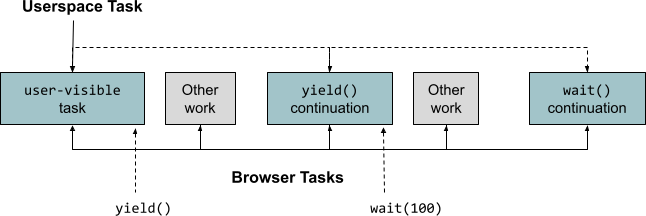
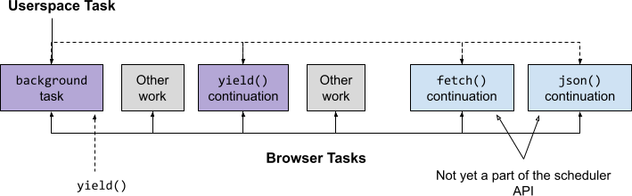
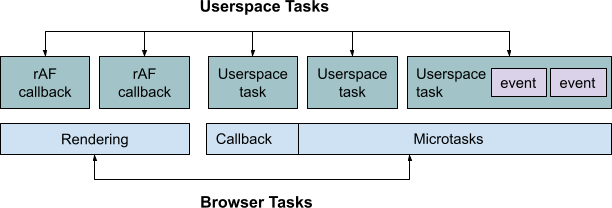

# Userspace Task Models

## Introduction

A *task* is a fundamental concept in scheduling, representing some amount of
work to be performed. But how we think about and model tasks can vary.  This
document explores various userspace[<sup>1</sup>](#notes) task models, how they map to
the browser's event loop, and how various scheduling APIs fit in.

## Userspace Tasks

A *userspace task* is JavaScript code that performs some amount of work, e.g.
fetch and display search results in response to a button click, render a
framework's virtual DOM, or hydrate all or part of a page. It's up to the web
developer as to how an application is broken into tasks.

Userspace tasks:

 * **Have an entry point**. This is commonly a callback, e.g. the one passed to
   `scheduler.postTask()` or `setTimeout()`, but can also be an event listener,
   a microtask[<sup>2</sup>](#notes), or [something else](#multiple-entry-points).

 * **Can be [synchronous or asynchronous](https://developer.mozilla.org/en-US/docs/Learn/JavaScript/Asynchronous/Introducing)**.
   We define an *asynchronous task* as a task with asynchronous control flow, i.e.
   it has an  *asynchronous hop* or *continuation*, such as a promise
   continuation or async callback. Synchronous tasks do not have asynchronous
   hops.

 * **Can be yieldy**. Async tasks are *yieldy* if they yield to the event loop
   during their execution, either by interacting with a yieldy async API, e.g.
   `fetch()`, or by purposefully yielding, e.g. scheduling continuations with
   `setTimeout()` or `postTask()`. Note that async tasks are not necessarily
   yieldy.

 * **Have a developer-defined end point**. Async work spawned by a task may or
   may not be part of the same userspace task, but the browser does not
   currently have great insight into this[<sup>3</sup>](#notes).

## Event Loop and Browser Tasks

HTML also has the concept of a
[task](https://html.spec.whatwg.org/multipage/webappapis.html#concept-task),
which is a synchronous block of work executed by the browser's [event
loop](https://html.spec.whatwg.org/multipage/webappapis.html#event-loop-processing-model).
We refer to these tasks as *event loop tasks*. Userspace code often runs in an
event loop task, e.g. `postTask()` callbacks, but not exclusively:

 * The [rendering steps](https://html.spec.whatwg.org/multipage/webappapis.html#update-the-rendering),
   which include running `requestAnimationFrame()` and other callbacks, occur
   outside of event loop tasks. Furthermore, rendering may not occur in every
   turn of the event loop, e.g. due to throttling.
 * Userspace code often runs in [microtask
   checkpoints](https://html.spec.whatwg.org/multipage/webappapis.html#perform-a-microtask-checkpoint),
   which can occur inside *and* outside of event loop tasks

To simplify our processing model, we split the event loop processing into two
phases, and define a **browser task** as a task that either (a) runs the next
event loop task and subsequent microtask checkpoint, or (b) runs the rendering
steps. We note that this matches Chromium's processing model.

## Simplified Task Models

Fully fleshing out various task models from both the userspace and browser
perspectives quickly gets complicated, so we start with the following
simplifying assumptions:

 1. Entry points are `scheduler.postTask()` callbacks, and each one starts a
    new task
 1. Related to (1), yieldy tasks use
    [`yield()`](../explainers/yield-and-continuation.md) or
    [`wait(timeInMs)`](https://github.com/WICG/scheduling-apis/issues/19#issuecomment-781655821)
    for continuations
 1. Only one userspace task runs per browser task

While simplified, this helps us differentiate between two common ways of
modeling tasks.

### Synchronous Tasks

The most basic task model under these assumptions is a synchronous task model
where all tasks are scheduled via `scheduler.postTask()` and end when the
associated callback terminates:


This task model works well if the tasks are reasonably short, but it can lead
to unresponsive pages if the tasks are long. The two common approaches to
mitigate this are:

 1. Break up the tasks into smaller pieces, scheduling all the pieces up
    front[<sup>4</sup>](#notes)
 1. Yield to the event loop after some time, scheduling a continuation to
    resume

### Yieldy Asynchronous Tasks

Yieldy async tasks are spread over multiple browser tasks, either by scheduling
a *continuation task* with `yield()` or `wait()` or by using an async API like
`fetch()`.



#### Yieldy Asynchronous Tasks and Threads

Yieldy async tasks enable some concurrency, and these tasks are analogous to
threads&mdash;well, non-preemptable threads running on a single-core machine:

  * The `postTask()` callback is the thread entry point
  * Calling `scheduler.yield()` or `scheduler.wait()` pauses the execution of
    the current thread/task (similar to `Thread.yield()` and `Thread.sleep()` in
    Java)
  * Threads, like `postTask()` tasks, often have a modifiable priority
  * Java's `Thread` also has the ability to get the current thread, which is
    similar to the [`scheduler.currentTaskSignal`](../explainers/post-task-propagation.md)
    proposal

### The Challenge of Mixing Async APIs

A major challenge with the [yieldy async task
model](#yieldy-asynchronous-tasks) is that the browser doesn't currently know
whether or not different browser tasks should be grouped together as the same
userspace task. Aside from being conceptually undesirable, there is a practical
implication around prioritization. Consider the following example:

```javascript
async function task() {
  startWork();
  await scheduler.yield();
  doMoreWork();
  let response = await fetch(myUrl);
  let data = await response.json();
  process(data);
}

scheduler.postTask(task, {priority: 'background'});
```

This would like something like this:



Even though the `fetch()` is conceptually part of the same task, we lose the
task context (i.e. priority) since other async APIs are not yet
"scheduler-aware". This means that only *part* of a yieldy task can be
prioritized, which is something we want to address.

From the browser's perspective, this results in the userspace task being spread
across multiple [task
sources](https://html.spec.whatwg.org/multipage/webappapis.html#task-source)[<sup>5</sup>](#notes).

## Expanding the Task Model

We would ideally like to create a unified userspace task model, which would
provide a framework to reason about how various scheduling APIs fit in a
holistic way. For example, what does it mean for APIs like `yield()` and
`wait()` to be used both with `postTask()` and non-`postTask()` tasks? What
about with rendering browser tasks?

The first step in expanding our simplified task models is to relax the
assumptions we made [above](#simplified-task-models), and in doing so we can
see a much more complicated picture emerge. 

### Multiple Entry Points

There are in fact a lot of different task entry points other than `postTask()`:

 * All platform API callbacks and event listeners might be considered task
   entry points, e.g. `requestionAnimationFrame()` and `requestIdleCallback()`
   callbacks, input events, network events, etc. 
 * Tasks that begin as a microtask[<sup>2</sup>](#notes)
 * `<script>` tags can be entry points if script starts executing
 * For [userspace schedulers](./userspace-schedulers.md), the task entry points are
   internal to the application code[<sup>6</sup>](#notes)

### Entry Point or Continuation?

Our assumption was that all continuations are (or will be) scheduled with the
(not-yet-implemented) `yield()` API, but applications currently use the *same*
APIs for scheduling tasks as they do for continuations. For example, consider
breaking up a long task into two halves with `postTask()`:

```javascript
function task() {
  startWork();
  // Is this a continuation or a separate task?
  scheduler.postTask(finishWork);
}
scheduler.postTask(task);
```

There is a similar problems with [mixing async
APIs](#the-challenge-of-mixing-async-apis): does the callback start a new task
or continue the previous one? For example, consider fetching a network resource
within a `postTask()` task:

```javascript
function task() {
 startWork();
 // Is this fetch related to this task, or starting a new task?
 fetch(url).then((response) => finishWork(response));
}

scheduler.postTask(task);
```

### Multiple Tasks Per Browser Task

There are myriad ways multiple tasks can start or run in a single browser task:

 * Multiple `requestAnimationFrame()` callbacks running in the same rendering
   task
 * Multiple event handlers running for the same event
 * Events firing during a task, potentially creating *nested userspace tasks*
 * Userspace schedulers that
   * run multiple userspace tasks in a single browser task
   * schedule work in microtasks, e.g.  with `queueMicrotask()`
 * Tasks beginning or continuing in microtasks, e.g. a task that resolves a
   promise might unblock a separate task, which continues in the subsequent
   microtask checkpoint

As an example, this can look something like this:



### Creating a Unified Task Model

**TODO**(shaseley): Work towards a unified model here while designing `yield()`
and `wait()`.

## Notes

<sup>1</sup>We use the term *userspace* in this document to refer to
application-layer JavaScript code, which includes 1P, library, framework, and
3P code.

<sup>2</sup>Microtasks can be tasks entry points if promises are used for
dependent work without scheduling the subsequent task, e.g.
`doSomething().then(startDependentTask);` This is a [pain
point](https://github.com/WICG/scheduling-apis/issues/14) for developers
writing scheduling code since task chaining like this can often lead to long
tasks when the new userspace task starts in the same browser task.

<sup>3</sup>More insight might be better here for a few reasons: (1) measuring
task duration is a common developer need, (2) developer tooling is likely to
benefit, and (3) the platform might be able to provide better abstractions and
APIs for working with tasks.

<sup>4</sup>The browser's scheduler (and importantly developer tooling) cannot
to tell conclusively that these tasks were related. Sharing a `TaskSignal`
could be a hint that they are, but different userspace tasks can share a
`TaskSignal` if they should be canceled or prioritized together. There may be
an opportunity here for scheduling APIs to better express the relationship
between work scheduled with `postTask()`.

<sup>5</sup>The HTML task model is centered on task sources. There is strict
ordering between tasks with the same source, and no guaranteed ordering between
different task sources (except idle callbacks).

<sup>6</sup>In the case of [userspace schedulers](./userspace-schedulers.md), the
task the browser sees is the "userspace scheduler task", which in turn executes
internal (userspace) tasks.
